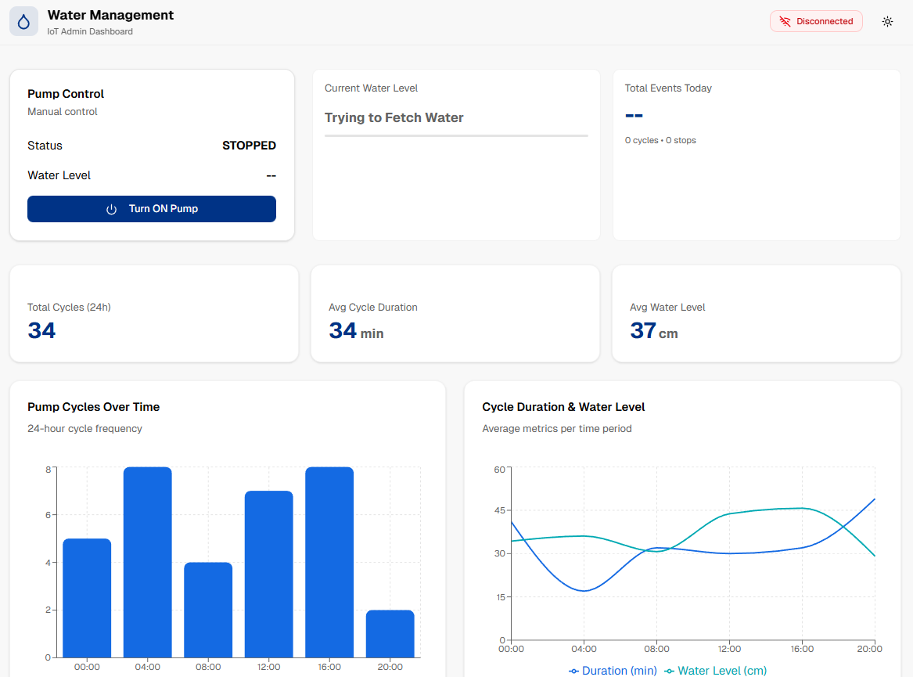
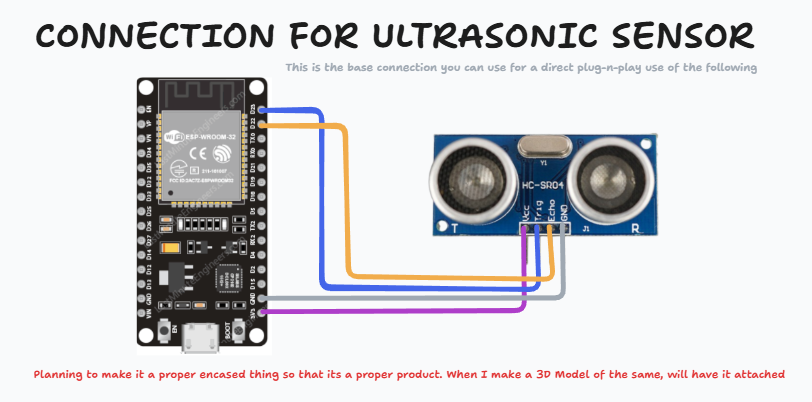

   
# FlowGuard - Monitor water. Control flow.


## INTRODUCTION
FlowGuard is a smart, real-time water level monitoring and pump control system built using IoT and a full-stack web dashboard.
It continuously tracks water levels using an ultrasonic sensor, allows intelligent pump control, and presents meaningful insights through a clean, minimal dashboard.

Designed with reliability and clarity in mind, FlowGuard bridges the gap between embedded systems and modern web interfaces, making water management smarter, safer, and easier to understand.

## FEATURES

- Real-Time Water Level Monitoring
Live water level updates from an ultrasonic sensor connected to an ESP device.

- Pump Control (ON/OFF)
Manually or automatically toggle the pump based on water levels and system logic.

- Live Connection Status
Instant visibility of ESP connectivity via ACK-based heartbeat monitoring.

- Event Logging & History
Tracks every pump ON/OFF event along with water level, duration, source, and timestamp.

- Weekly & Daily Analytics
Visual analytics showing pump cycles, average water levels, and operational trends.

- Minimal & Intuitive Dashboard
Clean UI designed for quick comprehension and real-world usability.


## TECH-OVERVIEW

### HARDWARE-CONNECTION


### TECHSTACK
- Hardware: ESP (MicroPython), Ultrasonic Sensor, Relay Module
- Backend: Node.js, Express, MongoDB
- Frontend: Next.js, React, Tailwind CSS, Recharts
- Communication: REST APIs (ESP → Backend → Frontend)

### ENV
This is the env for the backend. Use with your Mongo-DB or get a docker image and make for that
`backend/.env`
```
PORT=8808
MONGO_URI=mongodb://localhost:27017/waterLevel
```

## VERSION HISTORY

| Version | Date       | Description |
|---------|------------|-------------|
| v1.0.0  | 05/01/2026 | Base Dashboard With Proper ESP data connection and Data receiving and all. (Few Changes Expected) |
| v1.0.1  | TBA        | Minor Bug Fixes |
| v1.0.2  | TBA        | Proper CI/CD for the working check, that all is proper or no |
 

## CONTRIBUTING
Contributions are welcome!
If you’d like to improve FlowGuard or add new features:

- Fork the repository
- Create a new branch ( `feature/your-feature-name` )
- Commit your changes
- Open a Pull Request with a clear description
- Please ensure your code is clean, well-documented, and aligned with the existing architecture.

## FOOTER
This project was designed and built by @Th3C0d3Mast3r as a full-stack IoT system combining embedded programming, backend engineering, and modern frontend design *(lol, this sounds professional, but this is just a mini-project I thought to make of when I was facin this problem irl)*

If you found this project interesting or useful, consider starring the repository ;)